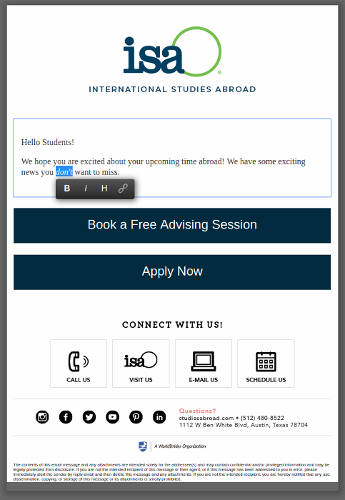
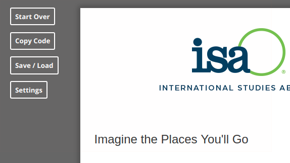
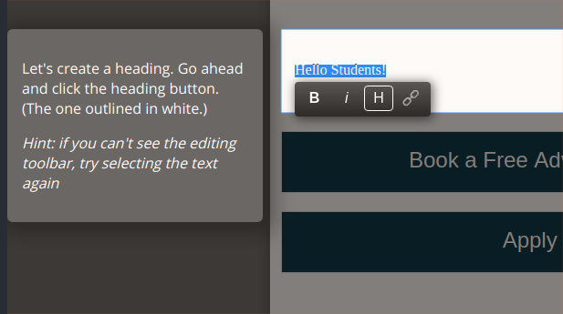

# ISA Easy Email

*Easily compose emails for International Studies Abroad*

Born out of the desire to have a simple, clutter-free way to compose HTML emails
for work, ISA Easy Email provides ISA employees with just that. Though they
still must use internal tools to create and send the email itself, this tool
allows ISA employees to see what they are writing as they are writing it.
Meanwhile, the writing interface provides all the editing tools one comes to
expect while being much less clunky than older rich text editors.

## Design
The application is centered around two main sections: the editor and the
controller.

### Editor
Of course, the editor is the main focal point here. Unlike the
internal editor, which hides the header and footer until the user previews their
email, this editor allows users to see how their email will look as they write
it.

The editor is built around the [WriteFree](https://jessereitz.github.io/WriteFree/)
editor, an open source editor I designed to mimic the excellent editor by the
folks at [Medium](https://www.medium.com). It provides core editing functionality
(bold and italic text, headings, links, images, and horizontal rules) in a sleek
and minimal package. It gets out of your way while you're writing while being
there when you need it.

### Controller
The controller allows the user to manipulate and interact with their email using
broad strokes, similar to the "File" menu in a desktop application. The
controller provides the following functions:
* Start Over - Simply refreshes the page so the user can start fresh
* Copy Code - This button automatically copies the code to the user's clipboard
  while also displaying a modal containing the code, just in case the copy
  function didn't work (this can be a problem in Firefox). Because of the way
  the internal editor is set up, users must copy the HTML code for their email
  and paste it in to the internal editor.
* Save / Load - ISA Easy Email allows users to save emails in the form of a JSON
  file and load them back up at a later date.
* Settings - Opens up a modal containing settings for the email title (used for
  file name) and the blue links at the bottom of the email.

### (BONUS) Tutorial
There is also a tutorial (which auto-loads on a user's first visit to the app)
which interactively takes the user through the application and its features/functions.
The tutorial is also accessible through the help section in the bottom left corner
of the page.

---
## Build Tools & Build Process
### Dependecies
When in production, ISA Easy Email relies on only two dependencies:
[WriteFree](https://jessereitz.github.io/WriteFree/) and
[Cookies.js](https://github.com/madmurphy/cookies.js). Both are installed in the
`src/vendor` directory. I have modified the latter slightly to be exported as an
es6 module.

### Build Tools
Everything is bundled up using [Rollup.js](https://github.com/rollup/rollup)
after being linted by [ESLint](https://github.com/eslint/eslint) (using
[AirBnB's JavaScript Style Guide](https://github.com/airbnb/javascript)),
transpiled using [Babel](https://github.com/babel/babel), and minified by
[Uglify](https://github.com/mishoo/UglifyJS).
